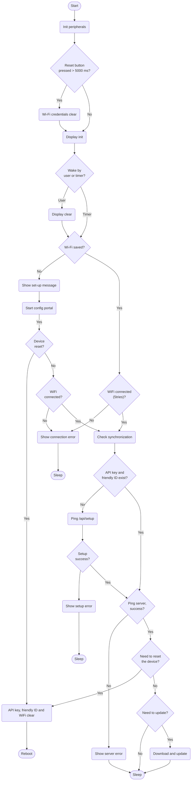

# TRMNL Firmware

created for the [TRMNL](https://usetrmnl.com) e-ink display.

## **Algorithm block scheme**



## **Web Server Endpoints**

following Wifi connection via the captive portal, device swaps its Mac Address for an API Key and Friendly ID from the server (which get saved on device).

```curl
GET /api/setup

headers = {
  'ID' => 'XX:XX:XX:XX:XX' # mac address
}

response example (success):
{ "status": 200, "api_key": "2r--SahjsAKCFksVcped2Q", "friendly_id": "917F0B", "image_url": "https://usetrmnl.com/images/setup/setup-logo.bmp", "filename": "empty_state" }

response example (fail, device with this Mac Address not found)
{ "status" => 404, "api_key" => nil, "friendly_id" => nil, "image_url" => nil, "filename" => nil }
```

assuming the Setup endpoint responded successfully, future requests are made solely for image / display content:

```curl
GET /api/display

headers = {
  'ID' => 'XX:XX:XX:XX',
  'Access-Token' => '2r--SahjsAKCFksVcped2Q',
  'Refresh-Rate' => '1800',
  'Battery-Voltage' => '4.1',
  'FW-Version' => '2.1.3',
  'RSSI' => '-69'
}

response example (success, device found with this access token):
{
  "status"=>0, # will be 202 if no user_id is attached to device
  "image_url"=>"https://trmnl.s3.us-east-2.amazonaws.com/path-to-img.bmp",
  "filename"=>"2024-09-20T00:00:00",
  "update_firmware"=>false,
  "firmware_url"=>nil,
  "refresh_rate"=>"1800",
  "reset_firmware"=>false
}

response example (success, device found AND needs soft reset):
{
 "status"=>0,
 "image_url"=>"https://trmnl.s3.us-east-2.amazonaws.com/path-to-img.bmp",
 "filename"=>"name-of-img.bmp",
 "update_firmware"=>false,
 "firmware_url"=>nil,
 "refresh_rate"=>"1800",
 "reset_firmware"=>true
}

response example (success, device found AND needs firmware update):
{
 "status"=>0,
 "image_url"=>"https://trmnl.s3.us-east-2.amazonaws.com/path-to-img.bmp",
 "filename"=>"name-of-img.bmp",
 "update_firmware"=>true,
 "firmware_url"=>"https://trmnl.s3.us-east-2.amazonaws.com/path-to-firmware.bin",
 "refresh_rate"=>"1800",
 "reset_firmware"=>false
}

response example (fail, device not found for this access token):
{"status"=>500, "error"=>"Device not found"}

if 'FW-Version' header != web server `Setting.firmware_download_url`, server will include absolute URL from which to download firmware.
```

if device detects an issue with response data from the `api/display` endpoint, logs are sent to server.

```curl
POST /api/log

# example request tbd
```

## **Power consumption**

A bit of background first. The ESP32-C3 inside the TRMNL OG is one of Espressif's newer, more efficient microcontrollers. For battery powered applications, it's designed to be put to sleep to conserve power when your project doesn't need it to be active. There are two sleep modes - light and deep. Deep sleep conserves the most power, but at the cost of losing the contents of the main memory. The lowest possible power consumption is about 4uA @ 3V with a timed wakeup, but TRMNL needs to be able to wake up with a button press. Keeping the GPIO active during deep sleep (to detect the button press) uses about 100uA on average (see power profile below). This means that a 2500mAh battery could theoretically keep the TRMNL powered in this state for approximately 25,000 hours.


Of course its not very useful to have a device that's permanently sleeping, so shown below is the power profile of TRMNL doing a normal display update (timed wake up, send device status, fetch new image, show it on the e-paper display):


The peaks and valleys you see above represent the variation in electrical current (power) drawn by the ESP32-C3 at different points during the ~10.5 second update cycle. The majority of energy is used while WiFi is active (between the 3 and 9 second marks). The last portion of the graph with higher frequency peaks is from the e-paper display cycling through its update (average power is quite low). The total electrical charge needed for the update is shown in the lower right corner (0.67c). This value is in Coulombs and represents the number of electrons that have moved through the circuit.

0.67 C = 0.186111 mAh

If we ignore the ESP32 sleep periods, the energy used in each display update would allow 2500/0.186111 = 13433 updates. If we configure our TRMNL account to update the information every 15 minutes, we'll be requesting 96 updates per day and the battery charge could last for 140 days (13433 / 96). This isn't too far off from real world results. The battery voltage will drop below a safe threshold before it has released its full energy and in the equation above, we haven't counted the energy used during the sleep periods nor the energy lost in the TRMNL's power supply (between the battery and the ESP32). The real world result will be closer to 120 days on a full charge.

We can extend the battery life further by disabling updates during our sleeping hours. In the TRMNL web portal there is a setting for “Sleep Mode” (see screenshot below):


For example - by reducing the total active time each day by 8 hours, the number of updates per day (set to a 15-minute interval like above) changes from 96 to 64. With sleep mode set to 8 hours, our battery life is extended:

13433 / 64 = 210 days (theoretical maximum)

**Designed for Efficiency**

Lithium batteries deliver between 3.7 and 4.2 volts depending on their charge state. The ESP32 operates between 2.8V and 3.3V. In order to power the ESP32 from the battery, the voltage needs to be reduced.

There are two main types of power regulators - [buck](https://en.wikipedia.org/wiki/Buck_converter) converters, and [linear](https://en.wikipedia.org/wiki/Linear_regulator) regulators. Many ESP32 products use linear regulators since they are less expensive. This savings comes at a cost - they throw away up to 20% of the battery's energy as waste heat. Your TRMNL was designed with a buck converter to safely and efficiently power the ESP32. This ensures the best use of the battery's energy. At TRMNL we are always looking for additional software optimizations that improve battery life.

## **Low Battery Level**

Lithium ion batteries are ubiquitous in our lives; they're in nearly everyone's pocket/purse and many other devices you use daily. They bring a host of benefits, some risks and require care to keep them working at their best. Your TRMNL protects the battery against overcharging, but your help is needed to prevent problems when the battery is low. There are two main problems that arise with dead Li-Ion batteries:

1. If they pass below a certain voltage, they need to be recharged with a special trickle charger; the charging circuit of the TRMNL won't be able to charge them.
2. Batteries that are left uncharged for an extended period of time can “outgas”. This means that the electrolyte goes through a chemical reaction and releases hydrogen gas. You may have seen batteries in this state - the metal envelope puffs up like a balloon.

The conditions above are to be avoided, but `#2` can be dangerous as well. If your battery is puffy, dispose of it safely at a local recycling spot and contact TRMNL support to get a new one.

Even when your TRMNL is disconnected (power switch in the off position), its battery will slowly self-discharge. To keep your TRMNL's battery running at peak performance:
1. Charge your device immediately when the low battery image is shown.
2. If you've switched off your TRMNL for storage/moving, ensure the battery is not already low.

## **Version Log**

See [releases](https://github.com/usetrmnl/firmware/releases). For older versions go [here](https://github.com/usetrmnl/firmware/issues/95).

## **Compilation guide**

There are technical and non-technical options to flashing firmware.

**No code required**

* Flash directly from a web browser: https://usetrmnl.com/flash
* Enable OTA updates from your TRMNL dashboard > Device settings (native hardware only)

**For developers**

1. Install VS Code: https://code.visualstudio.com
2. Install PlatformIO: https://platformio.org/install/ide?install=vscode
3. Install Git: https://git-scm.com/book/en/v2/Appendix-A%3A-Git-in-Other-Environments-Git-in-Visual-Studio-Code
4. Clone this repository: https://github.com/usetrmnl/trmnl-firmware
5. Open project in VS Code workspace
6. After configuring the project, click the PlatformIO -> Build button located at the bottom of the screen


7. After the compilation process is complete, you should expect to see a message in the console.


8. You can find the compiled file in the folder shown in the picture.


## **Uploading guide (PlatformIO)**

1. Turn off PCB. Connect PCB to PC using USB-C cable. While holding down the boot button, turn on PCB. Let go of boot button. This puts board in flashing mode.

2. Mac/Windows: Select the proper COM port from drop-down list (or leave on "Auto"). Ubuntu: Look for something like "/dev/ttyACMO USB JTAG/serial debug unit" or "Espressif USB JTAG/serial debug unit" via lsusb.


3. Click on "PlatformIO: Upload" button.

## **Uploading guide (ESP32 Flash Download Tool)**

Tools required:

1. Windows OS
2. Flash Tool 3.9.5
3. Binaries to merge - `bootloader.bin`, `firmware.bin`, `partitions.bin` (see Compilation Guide above)
4. Bootloader binary file (`boot_app0.bin`, found in ~/.platformio/packages/framework-arduinoespressif32/tools/partitions/)

### Step 1 - Configure flash tool
open the Flash Tool (executable file), select these parameters, then click OK:


### Step 2 - Add binaries
1. Beside the top blank space, click “...” dots and select the bootloader binary file then input
> “0x00000000”
in the far right space and check the box.

2. Click “...” dots and select the partitions binary file then input
> “0x00008000”
in the far right space and check the box.

3. Click “...” dots and select the boot_app0 binary file then input
> “0x0000e000”
in the far right space and check the box.

4. Click “...” dots and select the firmware binary file then input
> “0x00010000”
in the far right space and check the box.


finally, set the following parameters at the bottom of the Flash Tool interface:


### Step 3 - Connect and flash device
1. Open the Windows “Device Manager” program and scroll to the bottom where the USB devices can be found. each machine will have different available devices, but look for a section like this:


2. Next, connect the PCB to the Windows machine with a USB-C cable. make sure the USB port is on the right, and that the PCB’s on/off switch is toggled DOWN for “off.”

3. While holding the BOOT button (below the on/off toggle), toggle the device ON by flipping the above switch UP. you may hear a sound from your Windows machine Inspect the Device Manager connections at the bottom of the interface, and a new device should appear. it may be “USB Component {{ Num }},” or something like below:


4. Take note of this device’s name, that is our TRMNL PCB. then back inside the Flash Tool, click to open the “COM” dropdown in the bottom right and choose the TRMNL PCB. finally, click the “START” button.


### Step 4 - Prepare for new device flashing
Inside the Flash Tool click the “STOP” button.


Next turn off (toggle DOWN) and unplug the PCB. you are now ready to flash another device - see Step 1.

## **Hacking guide**

If you would like to run local tests, you'll need to have g++/gcc installed (f.e., as part of MinGW) in PATH:

- Get MinGW online installer from https://github.com/niXman/mingw-builds-binaries/
- Add path to `bin` from installed folder (f.e. `c:\mingw64\bin`) to your PATH
- Restart Visual Studio Code

Now you can switch from "env:esp32..." to "esp:native" clicking at the bottom of the studio (point 1):


And then run platformio tests by clicking test button (point 2).
